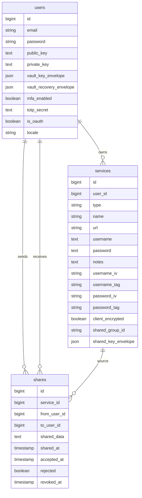

# 01 - Vision et carte du projet

## Probleme resolu

NexusVault est un gestionnaire de mots de passe. L'utilisateur peut stocker des
identifiants, cartes bancaires et notes securisees, puis les consulter depuis un
coffre personnel. Le projet a evolue d'un chiffrement surtout serveur vers un
modele zero-knowledge: le serveur ne doit pas connaitre le mot de passe du
coffre ni les secrets stockes dans le coffre.

Le besoin initial etait scolaire: construire un password manager, le deployer
avec nom de domaine et HTTPS, et fournir une experience complete. Le projet est
devenu plus ambitieux: separation login/vault password, MFA, passkeys, partage
chiffre, recovery key, et deploiement VPS securise.

## Fonctionnalites majeures

### Authentification

- inscription email + password;
- verification email via notification Laravel;
- login en deux temps: email, puis mot de passe;
- OAuth Google/GitHub via Socialite;
- passkeys WebAuthn via Laragear WebAuthn;
- MFA TOTP avec QR code servi par `/mfa/qr-code`;
- logout et invalidation de session;
- changement de mot de passe de connexion.

### Coffre

- creation d'un mot de passe de coffre distinct du mot de passe de connexion;
- generation d'une recovery key;
- unlock par mot de passe de coffre;
- unlock par recovery key;
- reset destructif du coffre;
- middleware `master_key` pour bloquer l'acces aux routes sensibles tant que le
  coffre n'est pas deverrouille.

### Items du coffre

Les items sont stockes dans la table `services`.

Types actuels:

- `login`;
- `payment_card`;
- `secure_note`.

Chaque item contient:

- un nom;
- un type;
- une URL et favicon si applicable;
- un champ principal (`username`, `cardholder`, reference);
- un secret (`password`, numero de carte, contenu securise);
- des notes;
- des metadonnees de partage;
- des champs de chiffrement (`iv`, `tag`, ciphertext).

### Securite du mot de passe

Pour les items `login`, l'UI inclut:

- generateur de mot de passe;
- personnalisation du generateur;
- estimation d'entropie;
- detection de reutilisation;
- verification de compromission lorsque disponible.

En mode zero-knowledge, l'analyse serveur des secrets est limitee, parce que le
serveur ne voit plus le mot de passe en clair. Le document `04` explique ce
compromis.

### Partage

NexusVault supporte:

- preparation du partage avec recherche du destinataire;
- partage chiffre;
- acceptation/refus;
- revocation;
- suppression differenciee cote owner/recipient;
- partage synchronise zero-knowledge via cle d'item partagee.

Le partage synchronise est detaille dans `06-coffre-items-et-partage.md`.

### UI / UX

- theme visuel sombre/clair;
- preference de langue anglais/francais;
- tableaux et vues detail;
- modales de creation/edition/suppression/partage;
- feedback par toast;
- pages legales.

## Stack technique

### Backend

- Laravel 13;
- PHP 8.5 en dev/prod cible;
- Form Requests pour validation;
- Controllers fins;
- Services applicatifs;
- Eloquent models;
- migrations Laravel;
- Pest pour tests.

### Frontend

- Blade pour les vues principales;
- TypeScript pour l'interactivite;
- Vite pour build;
- WebCrypto pour le chiffrement cote navigateur;
- Wayfinder pour generation de routes/actions TypeScript.

### Donnees

- SQLite possible en local;
- MariaDB en production;
- sessions/cache/queue en base en production.

### Production

- VPS Hetzner;
- Ubuntu;
- Nginx;
- PHP-FPM;
- MariaDB;
- Certbot/Let's Encrypt;
- UFW + firewall Hetzner;
- Fail2Ban;
- Resend pour email.

## Carte des routes principales

### Public

```text
GET  /                         home
GET  /terms                    legal.terms
GET  /privacy                  legal.privacy
GET  /cookies                  legal.cookies
GET  /accessibility            legal.accessibility
POST /locale                   locale.update
```

### Auth classique

```text
GET  /register
POST /register/validate
POST /register

GET  /login
POST /login
GET  /login/password
POST /login/password
POST /logout
```

### OAuth

```text
GET /auth/google
GET /auth/google/callback
GET /auth/github
GET /auth/github/callback
```

### Email verification

```text
GET  /email/verify
POST /email/verification-notification
GET  /email/verify/{id}/{hash}
```

### MFA

```text
GET  /mfa/setup
GET  /mfa/qr-code
POST /mfa/setup
GET  /mfa/verify
POST /mfa/verify
POST /mfa/disable
```

### Vault

```text
GET  /vault/setup
POST /vault/setup
GET  /vault/unlock
POST /vault/unlock
POST /vault/reset
POST /vault/lock
```

### Coffre et partage

```text
GET    /dashboard
GET    /services/{name}
POST   /services
PUT    /services/{service}
DELETE /services/{service}

POST   /shares/prepare
POST   /shares
POST   /shares/{share}/accept
POST   /shares/{share}/reject
DELETE /shares/{share}/revoke
GET    /notifications
```

### Settings / Passkeys

```text
GET    /settings
POST   /settings/password
POST   /settings/pfp
DELETE /settings/account
POST   /settings/theme
GET    /passkeys
DELETE /webauthn/credentials/{credential}
POST   /webauthn/register/options
POST   /webauthn/register
POST   /webauthn/login/options
POST   /webauthn/login
```

## Domain model simplifie



## Lecture rapide du depot

```text
app/Http/Controllers
  Entrees HTTP: auth, vault, services, shares, MFA, settings.

app/Http/Requests
  Validation serveur des formulaires et payloads JSON.

app/Services/Auth
  Login, register, OAuth, MFA, reset password, ancienne logique de cle serveur.

app/Services/Vault
  Creation/edition/suppression d'items, favicons, partage.

app/Services/Security
  Ancienne couche crypto serveur. A documenter comme compatibilite historique.

resources/ts/zero-knowledge.ts
  Coeur crypto navigateur: vault key, recovery, AES-GCM, RSA-OAEP, partage.

resources/ts/auth.ts
  Glue entre formulaires Blade et WebCrypto.

resources/js/pages/service.ts
  Dechiffrement affichage, edition, chiffrement avant update.

tests/Feature
  Tests de vault unlock, sharing, MFA, passkeys, items, locale, legal pages.
```

## Workflows principaux

### Inscription email/password

1. L'utilisateur remplit nom, email, login password, vault password.
2. Le navigateur valide que login password et vault password sont differents.
3. Le navigateur appelle `/register/validate` pour valider les champs compte.
4. Si la validation serveur passe, le navigateur genere le paquet de coffre:
   `vault_key_envelope`, `vault_recovery_envelope`, public key, private key
   chiffree.
5. Le navigateur affiche la recovery key et exige confirmation.
6. Le formulaire final est soumis.
7. Laravel stocke le password de login hashe et les enveloppes chiffrees.
8. Laravel envoie l'email de verification.

### OAuth

1. Google/GitHub renvoie l'utilisateur a Laravel.
2. Laravel cree ou retrouve le user.
3. Les nouveaux OAuth users sont verifies par defaut cote email.
4. Si le user OAuth n'a pas `vault_key_envelope`, il est force vers
   `/vault/setup`.
5. Il n'existe plus de voie "legacy OAuth vault unlock".

### Unlock du coffre

1. Le serveur rend l'enveloppe du vault key dans la page unlock.
2. Le navigateur derive une cle de wrapping a partir du vault password.
3. Le navigateur decrypte la vault key.
4. La vault key est stockee dans `sessionStorage`.
5. Le navigateur soumet `client_unlocked=1`.
6. Laravel ne recoit pas le vault password; il marque seulement la session
   avec `vault_unlocked_at`.

### Creation/edition d'un item

1. L'utilisateur saisit le contenu en clair dans le navigateur.
2. TypeScript chiffre les champs sensibles avec la vault key ou la shared key.
3. Le serveur recoit ciphertext, IV et tag.
4. Laravel valide la forme et stocke les donnees.
5. A l'affichage, le navigateur decrypte les champs avant rendu.

### Partage synchronise

1. Le owner decrypte son item localement.
2. Le navigateur cree ou reutilise une shared item key.
3. Les champs sont chiffres avec cette shared key.
4. La shared key est chiffree pour le destinataire avec sa cle publique RSA.
5. Le destinataire accepte et stocke une copie + une enveloppe de shared key
   chiffree sous sa propre vault key.
6. Les editions ulterieures du owner propagent les nouveaux ciphertexts aux
   copies du groupe partage.
