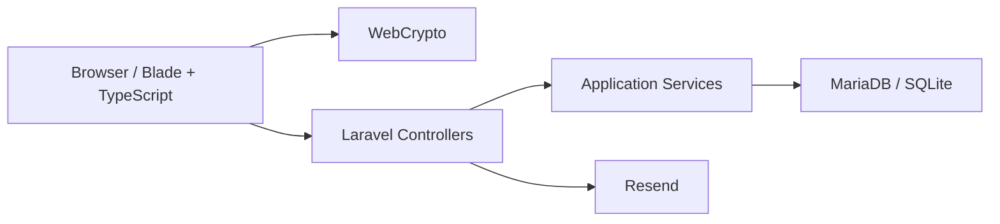

# 02 - Architecture applicative et code

## Vue d'ensemble

NexusVault suit une architecture Laravel classique, enrichie par une couche
TypeScript importante. Le backend ne doit pas faire toute la logique: pour le
zero-knowledge, le navigateur est une partie active de l'architecture.



Le navigateur chiffre/dechiffre. Laravel authentifie, valide, autorise, persiste
et orchestre.

## Reperes de dossiers

```text
app/
  DTOs/
  Exceptions/
  Http/
    Controllers/
    Middleware/
    Requests/
  Mappers/
  Models/
  Notifications/
  Providers/
  Services/

resources/
  css/
  js/
    app.ts
    pages/
  ts/
    auth.ts
    zero-knowledge.ts
    zero-knowledge-sharing.ts
    WebAuthn.ts
    utils/
  views/

database/
  migrations/
  factories/

tests/
  Feature/
  Unit/
```

## Controllers

Les controllers sont les entrees HTTP. Ils ne devraient pas contenir toute la
logique metier.

Principaux controllers:

- `RegisterController`: affiche l'inscription, valide les champs compte, cree le
  user avec ses enveloppes zero-knowledge.
- `LoginController`: login email/password.
- `OAuthController`: redirection et callback Google/GitHub.
- `MfaController`: setup TOTP, QR image, verification.
- `VaultSetupController`: setup du coffre pour OAuth users sans enveloppe.
- `VaultUnlockController`: unlock du coffre et session `vault_unlocked_at`.
- `VaultResetController`: reset destructif du coffre.
- `DashboardController`: dashboard principal.
- `ServiceController`: CRUD des items.
- `ShareController`: preparation, creation, accept/reject/revoke des partages.
- `SettingsController`: password, avatar, theme, sessions, passkeys.

## Services applicatifs

Les services concentrent les decisions metier.

### Auth services

```text
app/Services/Auth/RegisterService.php
app/Services/Auth/LoginService.php
app/Services/Auth/OAuthService.php
app/Services/Auth/MfaService.php
app/Services/Auth/UserKeyService.php
```

`RegisterService` stocke un user moderne avec:

- password de login hashe;
- public key;
- private key chiffree cote navigateur;
- `vault_key_envelope`;
- `vault_recovery_envelope`;
- `encrypted_master_key = null`.

`OAuthService` cree un user OAuth sans vault, puis force `/vault/setup` tant que
`vault_key_envelope` est absent.

`UserKeyService` et `CryptoService` correspondent a l'ancien modele de
chiffrement serveur. Ils restent dans le depot, mais le flux moderne doit passer
par `client_encrypted=true`.

### Vault services

```text
app/Services/Vault/ServiceService.php
app/Services/Vault/ShareService.php
app/Services/Vault/FaviconService.php
app/Services/Vault/EncryptionRotationService.php
```

`ServiceService` cree, met a jour, supprime et synchronise les items. Pour un
utilisateur moderne, il stocke les champs deja chiffres par le navigateur.

`ShareService` gere deux familles de partage:

- legacy/server-side share, pour compatibilite historique;
- client encrypted share et client encrypted sync, pour le modele moderne.

## Requests et validation

Les Form Requests sont critiques parce que le serveur ne peut pas faire
confiance a l'UI.

Exemples:

- `RegisterUserRequest` exige les enveloppes de coffre.
- `VaultSetupRequest` exige les enveloppes de coffre pour OAuth setup.
- `CreateServiceRequest` et `UpdateServiceRequest` exigent `client_encrypted`
  pour les utilisateurs qui ont un coffre client.
- `ShareRequest` exige les payloads chiffres pour les partages zero-knowledge.

Decision importante:

```php
$clientEncryptionRules = $this->user()?->usesClientSideVault()
    ? ['required', 'accepted']
    : ['nullable', 'boolean'];
```

Cette regle empeche un utilisateur moderne d'envoyer volontairement un item en
clair vers le serveur.

## Models

### `User`

Champs importants:

- `password`: hash du login password;
- `public_key`: cle publique RSA pour recevoir des partages;
- `private_key`: private key RSA chiffree cote navigateur;
- `encrypted_master_key`: ancien modele serveur, null pour flux moderne;
- `vault_key_envelope`: vault key chiffree avec une cle derivee du vault password;
- `vault_recovery_envelope`: vault key chiffree avec la recovery key;
- `mfa_enabled`, `totp_secret`;
- `is_oauth`;
- `locale`.

Methodes importantes:

- `usesClientSideVault()`;
- `requiresClientVaultSetup()`.

### `Service`

`Service` represente un item de coffre. Le nom vient de la version initiale ou
un "service" etait surtout un compte externe comme Netflix, GitHub, YouTube.

Champs importants:

- `type`: `login`, `payment_card`, `secure_note`;
- `username`, `password`, `notes`: ciphertexts en mode moderne;
- `*_iv`, `*_tag`: nonce/tag AES-GCM;
- `client_encrypted`: vrai si le serveur ne doit pas decrypter;
- `shared_group_id`: groupe de partage synchronise;
- `shared_key_envelope`: shared item key chiffree sous la vault key du user.

Les accessors `getUsernameAttribute`, `getPasswordAttribute`, `getNotesAttribute`
tentent encore de dechiffrer cote serveur si `client_encrypted=false`. Pour les
utilisateurs modernes, ils renvoient les ciphertexts.

### `Share`

`Share` represente une invitation de partage:

- source service;
- owner;
- recipient;
- payload chiffre;
- dates d'acceptation/revocation;
- flag `rejected`.

## Mappers et DTOs

Les mappers transforment les requetes en objets plus explicites.

```text
App\Mappers\ServiceMapper
App\Mappers\ShareMapper
App\Mappers\AuthMapper
```

Les DTOs rendent les signatures plus lisibles:

```text
App\DTOs\Service\ServiceData
App\DTOs\Share\ShareData
App\DTOs\Share\SharePayload
App\DTOs\Share\AcceptedShareResult
App\DTOs\Auth\LoginData
```

## Frontend TypeScript

### `resources/ts/zero-knowledge.ts`

Fichier le plus important pour la securite du coffre moderne.

Il contient:

- types d'enveloppes;
- derivation PBKDF2;
- AES-GCM;
- RSA-OAEP;
- generation vault key;
- generation recovery key;
- chiffrement/dechiffrement de champs;
- creation et lecture de payloads de partage.

### `resources/ts/auth.ts`

Ce fichier relie les formulaires Blade au modele zero-knowledge:

- inscription;
- setup vault OAuth;
- unlock par vault password;
- unlock par recovery key;
- reset destructif;
- passkey login;
- generateur de mot de passe;
- toggles d'affichage.

### `resources/js/pages/service.ts`

Ce fichier pilote la page detail d'un service:

- dechiffrement des comptes charges;
- rendu du detail;
- edition;
- chiffrement avant update;
- partage;
- revoke;
- suppression;
- rendu des alertes de securite.

### `resources/ts/zero-knowledge-sharing.ts`

Ce fichier gere le flux de partage cote navigateur:

- preparation du partage;
- recuperation de la public key du recipient;
- chiffrement de la shared item key;
- acceptation de partage;
- creation de l'enveloppe recipient.

## Blade

Les vues Blade rendent l'application principale.

Reperes:

```text
resources/views/auth/
resources/views/dashboard/
resources/views/settings/
resources/views/passkey/
resources/views/legal/
resources/views/components/
```

Les vues exposent parfois des variables globales JS:

- `nexusVaultKeyEnvelope`;
- `nexusVaultRecoveryEnvelope`;
- `nexusVaultUsesClientEncryption`;
- `accounts`;
- `nexusVaultCurrentAccount`;
- `nexusVaultEncryptedPrivateKey`;
- `nexusVaultTranslations`.

Ces donnees ne doivent pas contenir de secret en clair. Elles contiennent des
enveloppes, ciphertexts ou metadonnees.

## Vite, Wayfinder et build

Commandes:

```bash
npm run dev
npm run build
npm run lint:check
npm run types:check
```

Le plugin Wayfinder genere des fichiers dans:

```text
resources/js/actions/
resources/js/routes/
```

En production, le build doit etre execute apres un pull qui modifie les routes ou
le TypeScript.

## Regles de style

PHP:

```bash
vendor/bin/pint --dirty --format agent
```

Tests:

```bash
php artisan test --compact
```

Build:

```bash
npm run build
```

## Ajout d'une nouvelle fonctionnalite

Exemple: ajouter un nouveau type d'item.

1. Ajouter une constante dans `App\Models\Service`.
2. Ajouter le type a `Service::types()`.
3. Adapter `CreateServiceRequest` et `UpdateServiceRequest`.
4. Adapter `ServiceData`.
5. Adapter `ServiceMapper`.
6. Adapter `resources/js/pages/service.ts` pour les labels et le rendu.
7. Ajouter ou adapter les vues Blade de creation/edition.
8. Ajouter des tests feature.
9. Executer:

```bash
vendor/bin/pint --dirty --format agent
php artisan test --compact
npm run build
```

## Pieges connus

### Ne pas envoyer de clair pour un coffre moderne

Si `user->usesClientSideVault()` est vrai, un POST `/services` ou PUT
`/services/{service}` doit envoyer:

- `client_encrypted=1`;
- ciphertext;
- IV;
- tag.

### Ne pas confondre login password et vault password

Le login password authentifie le compte Laravel. Le vault password ne doit jamais
etre soumis au serveur dans le flux moderne; il derive une cle dans le navigateur.

### Ne pas presenter `CryptoService` comme le coeur moderne

`CryptoService` montre l'ancien modele serveur. Il existe encore pour compatibilite,
mais la promesse zero-knowledge repose sur `resources/ts/zero-knowledge.ts`.

### Ne pas cacher la complexite du partage

Le partage synchronise zero-knowledge ne se reduit pas a copier un mot de passe.
Il repose sur une shared item key et des enveloppes distinctes par utilisateur.
