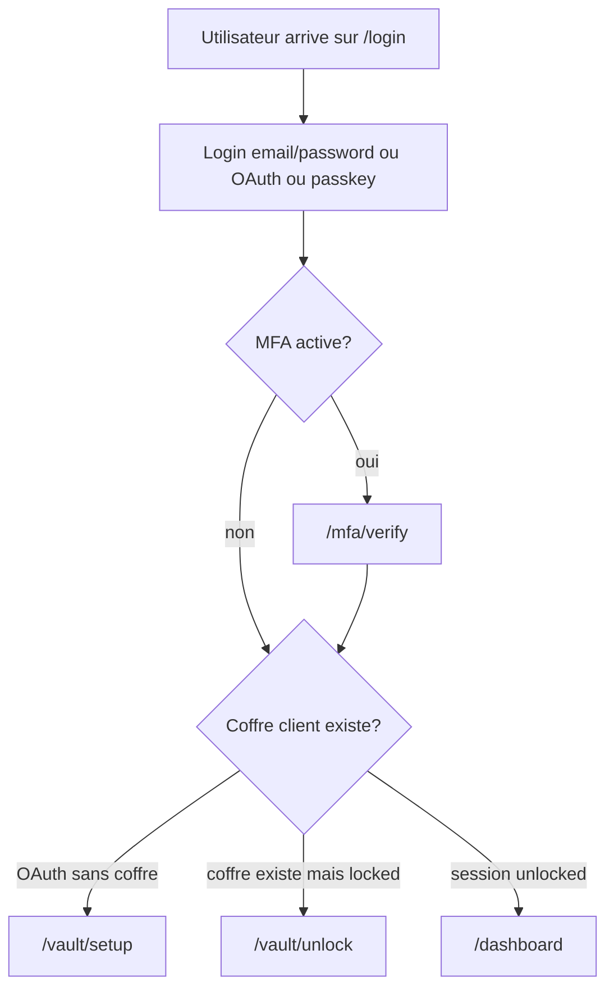

# 03 - Authentification, sessions et acces

## Objectif

NexusVault separe plusieurs notions qui sont souvent confondues:

- authentification du compte;
- verification email;
- MFA;
- deverrouillage du coffre;
- presence de la cle de coffre dans le navigateur.

Un utilisateur peut etre connecte sans avoir le coffre deverrouille. C'est une
decision centrale.

## Flux global



## Login classique

Fichiers:

```text
app/Http/Controllers/LoginController.php
app/Services/Auth/LoginService.php
app/Http/Requests/LoginEmailRequest.php
app/Http/Requests/LogUserRequest.php
```

Le login est separe en deux temps:

1. email;
2. password.

`LoginService`:

- retrouve l'utilisateur;
- verifie `Hash::check`;
- exige email verifie;
- connecte via `Auth::login`;
- regenere la session;
- redirige vers MFA, vault setup ou vault unlock.

Important: le login password n'est pas le vault password.

## Inscription

Fichiers:

```text
app/Http/Controllers/RegisterController.php
app/Services/Auth/RegisterService.php
resources/ts/auth.ts
resources/ts/zero-knowledge.ts
```

Sequence:

1. `auth.ts` valide le formulaire HTML.
2. `auth.ts` appelle `/register/validate`.
3. Laravel valide les champs compte avec `RegisterUserRequest::accountRules()`.
4. Si OK, le navigateur cree le paquet de coffre avec WebCrypto.
5. Le navigateur affiche la recovery key.
6. Le formulaire final est soumis.
7. Laravel stocke:
   - password de login hashe;
   - public key;
   - private key chiffree;
   - vault key envelope;
   - recovery envelope;
   - `encrypted_master_key = null`.
8. Laravel envoie l'email de verification.

Pourquoi valider avant de generer la recovery key?

Si le formulaire est invalide, afficher une recovery key puis refuser
l'inscription cree une experience incoherente: l'utilisateur croit avoir une cle
pour un coffre qui n'existe pas. NexusVault evite cela.

## OAuth

Fichiers:

```text
app/Http/Controllers/OAuthController.php
app/Services/Auth/OAuthService.php
```

Providers:

- Google;
- GitHub.

Nouveau user OAuth:

- password dummy random;
- `is_oauth=true`;
- email considere verifie;
- pas de coffre au depart;
- redirection vers `/vault/setup`.

Regle importante:

```php
public function requiresClientVaultSetup(): bool
{
    return $this->is_oauth && empty($this->vault_key_envelope);
}
```

Cela detruit l'ancienne voie "legacy OAuth vault unlock". Un OAuth user sans
enveloppe client doit creer un vrai coffre zero-knowledge.

## MFA TOTP

Fichiers:

```text
app/Http/Controllers/MfaController.php
app/Services/Auth/MfaService.php
resources/views/auth/mfa/setup.blade.php
```

Routes:

```text
GET  /mfa/setup
GET  /mfa/qr-code
POST /mfa/setup
GET  /mfa/verify
POST /mfa/verify
POST /mfa/disable
```

Le QR code est servi par `/mfa/qr-code` avec un `Content-Type: image/*`. Cela
evite de dependre d'un ``, qui peut etre casse par
certains contextes navigateur/headers.

Le secret TOTP est stocke cote serveur dans `users.totp_secret`, parce que le
serveur doit pouvoir verifier le code. Cette partie n'est pas zero-knowledge.

## Passkeys WebAuthn

Fichiers:

```text
resources/ts/WebAuthn.ts
resources/ts/passkey.ts
app/Http/Controllers/WebAuthn/
config/webauthn.php
```

Routes:

```text
POST /webauthn/register/options
POST /webauthn/register
POST /webauthn/login/options
POST /webauthn/login
DELETE /webauthn/credentials/{credential}
```

Contraintes:

- l'enregistrement d'une passkey exige `auth`, `mfa`, `master_key`;
- la suppression d'une passkey verifie que la credential appartient bien a
  l'utilisateur courant;
- le login passkey redirige ensuite vers MFA ou vault unlock/setup.

## Verification email

Le modele `User` implemente `MustVerifyEmail`.

Fichiers:

```text
app/Notifications/EmailVerifier.php
resources/views/emails/email-verification.blade.php
```

En production, l'email passe par Resend. En local, on peut utiliser log ou
Mailpit selon `.env`.

## Sessions Laravel

Config actuelle:

```env
SESSION_DRIVER=database
SESSION_LIFETIME=120
SESSION_ENCRYPT=false
```

En production, les sessions sont stockees en base. Le cookie contient l'identifiant
de session et les protections Laravel habituelles.

Variables de session importantes:

- `mfa_verified`: l'utilisateur a passe MFA dans cette session;
- `vault_unlocked_at`: Laravel considere que le coffre est deverrouille pour les
  routes protegees;
- `masterKey`: ancien modele serveur, absent pour les utilisateurs modernes.

Pour les utilisateurs zero-knowledge modernes, Laravel ne stocke pas la vault key.
Le navigateur stocke la vault key dans `sessionStorage`.

## Middleware `mfa`

Fichier:

```text
app/Http/Middleware/RequireMfa.php
```

Si l'utilisateur a `mfa_enabled=true` mais pas `mfa_verified`, il est redirige
vers `/mfa/verify`.

## Middleware `master_key`

Fichier:

```text
app/Http/Middleware/EnsureMasterKey.php
```

Ce middleware protege les routes sensibles.

Cas 1: OAuth sans coffre client:

- redirection vers `/vault/setup`;
- JSON: HTTP 428.

Cas 2: user moderne avec `vault_key_envelope`:

- si `vault_unlocked_at` existe: OK;
- sinon redirection vers `/vault/unlock`;
- JSON: HTTP 423.

Cas 3: user legacy sans client-side vault:

- essaie de recuperer `masterKey` en session;
- sinon redirection vers `/vault/unlock`.

## Unlock du coffre moderne

Fichiers:

```text
resources/views/auth/vault-unlock.blade.php
resources/ts/auth.ts
app/Http/Controllers/VaultUnlockController.php
```

Flux:

1. Blade expose `nexusVaultKeyEnvelope`.
2. L'utilisateur saisit le vault password.
3. TypeScript derive la wrapping key et decrypte la vault key.
4. TypeScript stocke la vault key dans `sessionStorage`.
5. TypeScript ajoute `client_unlocked=1`.
6. Laravel verifie seulement que ce flag existe.
7. Laravel stocke `vault_unlocked_at`.

Le serveur ne recoit pas le vault password.

## Recovery unlock

Flux:

1. Blade expose `vault_recovery_envelope`.
2. L'utilisateur saisit la recovery key.
3. TypeScript transforme la recovery key en bytes.
4. TypeScript decrypte la vault key.
5. Meme fin de flux que l'unlock normal.

## Logout et lock

Logout:

- supprime `masterKey` et `vault_unlocked_at`;
- `Auth::logout`;
- invalidate session;
- regenere token CSRF.

Lock:

- supprime `masterKey` et `vault_unlocked_at`;
- redirige vers `/vault/unlock`.

Limite: `clearStoredVaultKey()` existe cote TypeScript, mais le lock serveur doit
etre accompagne d'un nettoyage navigateur pour etre ideal. Voir `11-roadmap`.

## Matrice d'acces simplifiee

| Etat utilisateur | Route sensible | Resultat |
| --- | --- | --- |
| Non connecte | `/dashboard` | redirection login |
| Connecte, MFA active non verifiee | `/dashboard` | redirection `/mfa/verify` |
| OAuth sans coffre | `/dashboard` | redirection `/vault/setup` |
| Coffre client locked | `/dashboard` | redirection `/vault/unlock` |
| Coffre client unlocked | `/dashboard` | autorise |
| User legacy sans `masterKey` | `/dashboard` | redirection `/vault/unlock` |

## Ce que l'UI ne doit jamais etre seule a proteger

Exemple dangereux:

```blade
@if ($userCanDelete)
    <button>Delete</button>
@endif
```

Cela cache un bouton, mais ne protege pas la route. NexusVault verifie aussi:

- ownership dans `ServiceController`;
- permissions de partage dans `ShareService`;
- ownership passkey dans `SettingsController`;
- presence de `client_encrypted` dans les Form Requests.
