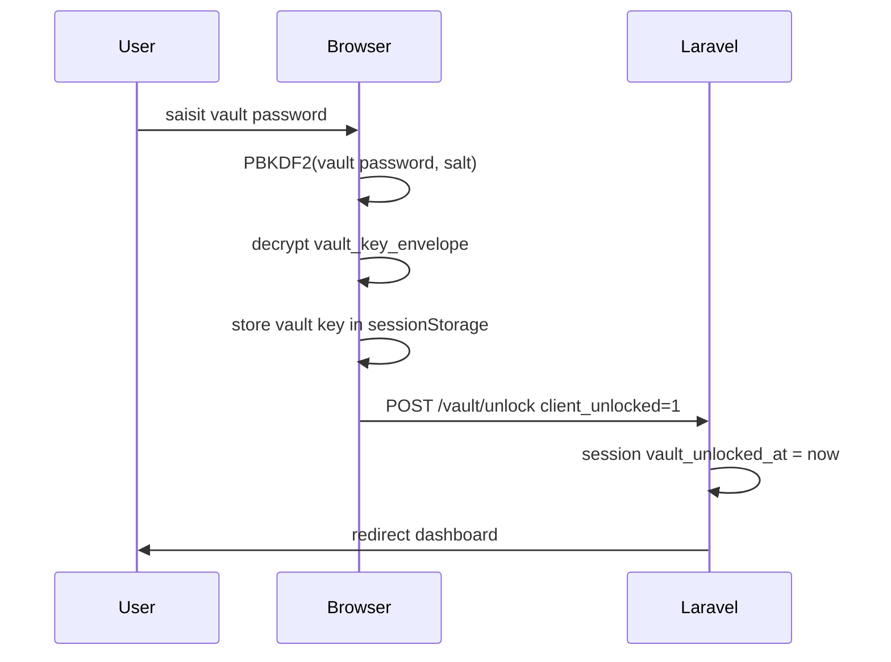
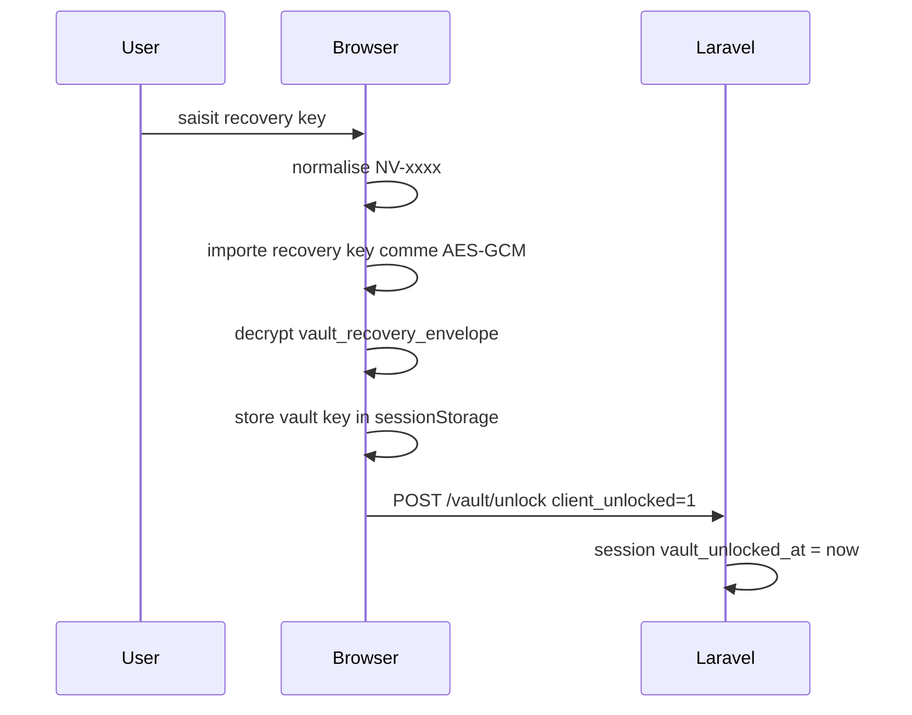

# 05 - Cycle de vie des cles et recovery

## Pourquoi documenter le cycle de vie?

Un password manager n'est pas seulement une base de donnees chiffree. Sa securite
depend surtout du cycle de vie des secrets:

- creation;
- stockage;
- transmission;
- utilisation;
- nettoyage;
- reset;
- perte;
- partage.

Ce document suit chaque cle importante dans NexusVault.

## Les secrets principaux

| Secret | Cree ou? | Stocke ou? | Sert a quoi? |
| --- | --- | --- | --- |
| Login password | utilisateur | hash serveur | authentifier Laravel |
| Vault password | utilisateur | jamais stocke | deriver la wrapping key |
| Vault key | navigateur | chiffree en enveloppes | chiffrer le coffre |
| Recovery key | navigateur | jamais stockee en clair | recuperer la vault key |
| RSA public key | navigateur | serveur en clair | recevoir des partages |
| RSA private key | navigateur | chiffree en base | decrypter shared keys |
| Shared item key | navigateur | chiffree par user | synchroniser un item partage |
| TOTP secret | serveur | serveur | verifier MFA |

## Creation initiale du coffre

Fonction:

```ts
createRegistrationVaultPackage(vaultPassword)
```

Etapes detaillees:

1. `randomBytes(16)` genere le salt PBKDF2.
2. `randomBytes(32)` genere la vault key.
3. `randomBytes(32)` genere la recovery key.
4. `deriveWrappingKey` transforme le vault password en cle AES-GCM.
5. `encryptBytes(wrappingKey, vaultKeyBytes)` produit `vault_key_envelope`.
6. La recovery key est importee comme cle AES-GCM.
7. `encryptBytes(recoveryWrappingKey, vaultKeyBytes)` produit
   `vault_recovery_envelope`.
8. Le navigateur genere une paire RSA-OAEP.
9. La public key est exportee en PEM.
10. La private key est exportee en PKCS#8.
11. La private key est chiffree avec la vault key.
12. La vault key est stockee dans `sessionStorage`.
13. La recovery key est affichee a l'utilisateur.

Le serveur recoit seulement:

```text
vault_key_envelope
vault_recovery_envelope
public_key
encrypted_private_key
```

## Representation des enveloppes

### `vault_key_envelope`

```json
{
  "version": 1,
  "algorithm": "AES-GCM",
  "kdf": "PBKDF2-SHA-256",
  "iterations": 600000,
  "salt": "...base64...",
  "iv": "...hex...",
  "ciphertext": "...base64...",
  "tag": "...hex..."
}
```

### `vault_recovery_envelope`

```json
{
  "version": 1,
  "algorithm": "AES-GCM",
  "keySource": "recovery-key",
  "iv": "...hex...",
  "ciphertext": "...base64...",
  "tag": "...hex..."
}
```

### `encrypted_private_key`

```json
{
  "version": 1,
  "algorithm": "AES-GCM",
  "keyFormat": "pkcs8",
  "iv": "...hex...",
  "ciphertext": "...base64...",
  "tag": "...hex..."
}
```

## Unlock par vault password



Le serveur n'a pas besoin de verifier le vault password. Si le navigateur arrive
a decrypter l'enveloppe, c'est que le mot de passe est correct. Le serveur ne
recoit qu'un signal d'etat de session.

## Unlock par recovery key



## Stockage runtime

La vault key en clair est stockee dans:

```text
sessionStorage["nexusvault:vault-key:v1"]
```

Avantages:

- ne persiste pas comme `localStorage`;
- isole par session de navigateur;
- plus simple a integrer avec Blade/TypeScript.

Limites:

- accessible a tout JavaScript execute sur l'origine;
- pas de zeroization memoire forte;
- si XSS, le coffre ouvert est compromis.

## Lock et logout

`VaultUnlockController@lock` supprime:

```text
masterKey
vault_unlocked_at
```

`LoginService@logout` supprime aussi ces elements, puis invalide la session.

Idealement, le navigateur doit aussi appeler:

```ts
clearStoredVaultKey()
```

pour supprimer `sessionStorage`. C'est une amelioration de durcissement indiquee
dans la roadmap.

## Reset destructif

Fichier:

```text
app/Http/Controllers/VaultResetController.php
```

Le reset destructif est le fallback choisi pour un password manager
zero-knowledge.

Pourquoi destructif?

Si le serveur ne connait pas la vault key, il ne peut pas "reinitialiser" le vault
password et garder les donnees. Changer le mot de passe sans vault key impliquerait
de decrypter et rechiffrer les donnees. Si l'utilisateur ne peut pas ouvrir le
coffre, c'est impossible.

Etapes du reset:

1. L'utilisateur confirme `RESET`.
2. Le navigateur cree un nouveau coffre vide:
   - nouvelle vault key;
   - nouvelle recovery key;
   - nouvelle paire RSA;
   - nouvelles enveloppes.
3. Laravel supprime:
   - les `Share` envoyes/recus;
   - les `Service` possedes ou partages avec cet utilisateur.
4. Laravel remplace les cles du user.
5. Laravel marque le coffre comme unlocked dans la session.

Consequence:

```text
Perte definitive des items anciens.
```

Cette brutalite est normale dans un vrai modele zero-knowledge. L'alternative
serait une recovery key ou un mecanisme de recovery plus avance.

## Changement de vault password

Il n'existe pas encore de fonctionnalite "changer le vault password" non
destructive.

Un changement propre necessiterait:

1. coffre deja deverrouille;
2. vault key disponible en navigateur;
3. saisie du nouveau vault password;
4. generation d'un nouveau salt;
5. nouvelle wrapping key;
6. nouveau `vault_key_envelope`;
7. optionnellement nouvelle `vault_recovery_envelope`.

Ce changement ne doit pas modifier la vault key ni rechiffrer tous les items. Il
doit seulement rechiffrer l'enveloppe de la vault key.

## Rotation des cles

### Rotation de vault password

Possible si vault key connue.

### Rotation de recovery key

Possible si vault key connue:

1. generer nouvelle recovery key;
2. chiffrer vault key avec nouvelle recovery key;
3. remplacer `vault_recovery_envelope`;
4. afficher la nouvelle recovery key;
5. invalider l'ancienne.

### Rotation de RSA key pair

Plus complexe. Il faut:

1. generer nouvelle paire;
2. chiffrer private key avec vault key;
3. remplacer public/private key;
4. gerer les partages existants, car les anciennes invitations chiffrees pour
   l'ancienne public key peuvent devenir inexploitables.

### Rotation de shared item key

Utile quand un destinataire est revoke. Mais attention: revocation cryptographique
parfaite apres lecture est impossible. Si le recipient a deja vu le secret, il
peut l'avoir copie.

Une rotation stricte impliquerait:

1. owner genere une nouvelle shared item key;
2. rechiffre l'item avec cette nouvelle cle;
3. rechiffre la cle pour les recipients restants;
4. met a jour les copies.

Ce n'est pas encore completement automatise.

## Scenarios de perte

### L'utilisateur oublie le login password

Laravel peut faire un reset password classique. Cela ne doit pas donner acces au
coffre. Apres reset login password, l'utilisateur doit toujours connaitre son
vault password ou sa recovery key.

### L'utilisateur oublie le vault password mais a sa recovery key

Il peut deverrouiller via recovery key.

### L'utilisateur oublie le vault password et perd la recovery key

Seul reset destructif.

### L'utilisateur perd son appareil

S'il connait son vault password, il peut se connecter ailleurs et ouvrir le
coffre. La vault key est rederivee depuis l'enveloppe.

### L'utilisateur a active MFA puis perd l'app authenticator

Le projet devrait ajouter des backup codes MFA. Ce n'est pas encore complet.

## Bonnes pratiques utilisateur

- choisir un vault password long et unique;
- ne pas reutiliser le login password comme vault password;
- sauvegarder la recovery key hors ligne;
- activer MFA;
- ajouter une passkey;
- verrouiller le coffre apres usage;
- eviter d'ouvrir le coffre sur un appareil non fiable.

## Bonnes pratiques developpeur

- ne jamais logger le vault password;
- ne jamais logger la recovery key;
- ne jamais ajouter de `console.log` des payloads dechiffres;
- ne jamais stocker la vault key en `localStorage`;
- verifier toute route qui modifie un item;
- garder les tests qui refusent `client_encrypted=0` pour les coffres modernes;
- documenter toute modification de primitive crypto dans un ADR.
