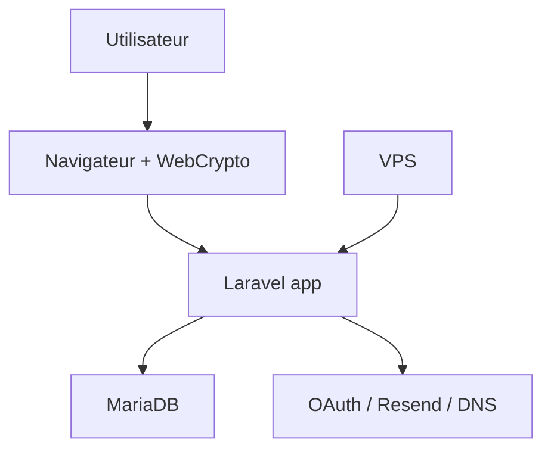

# 07 - Threat model, limites et risques

## Objectif

Un threat model explique ce que NexusVault essaie de proteger, contre qui, et ce
qui reste hors scope. Pour un password manager, cette transparence est plus
importante qu'une phrase marketing comme "military-grade encryption".

## Actifs a proteger

- vault password;
- vault key;
- recovery key;
- private key RSA;
- usernames/passwords/notes/cartes;
- TOTP secret;
- session utilisateur;
- OAuth credentials;
- Resend API key;
- APP_KEY/APP_PEPPER;
- base MariaDB;
- VPS et SSH key.

## Frontieres de confiance

La frontiere la plus importante est entre navigateur et serveur.

## Menaces principales

### Base de donnees volee

Impact:

- l'attaquant voit les users, metadonnees, envelopes, ciphertexts;
- il ne voit pas les secrets en clair pour les coffres modernes;
- il peut lancer une attaque offline sur `vault_key_envelope`.

Mitigations:

- vault password fort;
- PBKDF2 600k;
- AES-GCM;
- separation login/vault password;
- recovery key aleatoire.

Limites:

- metadonnees visibles;
- PBKDF2 n'empeche pas une attaque sur un vault password faible.

### Serveur compromis

Cas passif: l'attaquant copie le code et la base.

- protection similaire a base volee pour les coffres modernes;
- secrets prod comme APP_KEY, Resend, OAuth peuvent etre voles.

Cas actif: l'attaquant modifie le JavaScript servi au navigateur.

- tres grave;
- il peut exfiltrer vault password, recovery key ou vault key pendant unlock;
- le zero-knowledge ne protege pas contre un serveur actif malveillant qui livre
  du code modifie.

Mitigations possibles:

- deploy pipeline controle;
- integrity monitoring;
- CSP stricte;
- Subresource Integrity si assets separes;
- revue des commits;
- signatures de release;
- extension navigateur avec bundle auditable a terme.

### XSS

Impact:

- lecture de `sessionStorage`;
- exfiltration des champs dechiffres;
- actions au nom de l'utilisateur;
- vol de CSRF token.

Mitigations actuelles:

- Blade/React/Vue echappent par defaut;
- eviter `innerHTML`;
- CSRF Laravel;
- validation serveur.

Risques:

- certains scripts utilisent `innerHTML` pour du HTML controle par le code;
- une CSP stricte n'est pas encore documentee/appliquee completement;
- la vault key est accessible a JavaScript tant que le coffre est ouvert.

### Attaquant reseau

Mitigations:

- HTTPS via Let's Encrypt;
- cookies secure en production;
- Cloudflare DNS;
- Nginx.

Risques:

- mauvaise config DNS/HTTPS;
- downgrade ou HTTP si config incorrecte;
- certificat expire si renouvellement casse.

### Appareil utilisateur compromis

Hors scope complet. Si le poste est compromis:

- keylogger peut voler vault password;
- malware peut lire DOM/sessionStorage;
- extension malveillante peut observer la page.

Mitigations utilisateur:

- MFA;
- passkeys;
- appareil a jour;
- verrouiller le coffre;
- ne pas utiliser sur appareil public.

### Administrateur malveillant

Un admin serveur ne devrait pas pouvoir lire les vault items modernes en base.
Mais il peut:

- modifier le code servi;
- lire les logs;
- changer `.env`;
- manipuler la base;
- desactiver des protections.

Le zero-knowledge limite la lecture passive, pas le pouvoir actif d'un admin
malveillant sur l'application.

### Perte du vault password

Mitigation:

- recovery key.

Si recovery key aussi perdue:

- reset destructif seulement.

### MFA perdu

Actuellement, il faut prevoir une procedure de recuperation. Backup codes MFA
seraient une amelioration importante.

## Matrice de menaces

| Menace | Impact | Mitigation actuelle | Reste a faire |
| --- | --- | --- | --- |
| DB volee | ciphertexts + metadonnees exposes | WebCrypto, AES-GCM, PBKDF2 | AAD, schema envelope strict |
| Serveur passif compromis | secrets prod + DB | coffre moderne opaque | rotation secrets, backups chiffres |
| Serveur actif compromis | peut livrer JS voleur | aucune defense complete | integrity, CSP, audit deploy |
| XSS | coffre ouvert compromis | echappement par defaut | CSP, tests XSS, hygiene DOM |
| Mot de passe faible | attaque offline | PBKDF2 600k, generateur | politique vault password plus forte |
| Recovery key volee | coffre ouvert si DB volee | affichage ponctuel | rotation recovery key |
| Recipient revoke | peut garder secret deja vu | suppression copie | rotation shared key + changer secret externe |
| VPS brute force | acces SSH | firewall, UFW, Fail2Ban | monitoring alerting |
| Email compromis | reset login password | vault password separe | MFA backup/recovery claire |

## Donnees visibles par design

NexusVault accepte de reveler certaines metadonnees:

- existence d'un compte;
- email;
- nom;
- type d'item;
- nom de service;
- URL/favicons;
- timestamps;
- relations de partage;
- etat share accepted/rejected/revoked.

Pour cacher aussi ces metadonnees, il faudrait chiffrer plus de champs:

- `name`;
- `url`;
- `favicon`;
- `type`.

Mais cela rendrait la recherche, le groupement dashboard, les favicons et
l'affichage beaucoup plus complexes. C'est un compromis produit/securite.

## Risques lies au code legacy

`CryptoService`, `UserKeyService` et `encrypted_master_key` appartiennent au
modele historique. Les tests actuels verifient que les nouveaux flux OAuth ne
peuvent plus utiliser l'ancien unlock.

Risque:

- un ancien user ou une route mal protegee pourrait encore passer par le modele
  serveur.

Mitigations:

- Form Requests exigent `client_encrypted` pour users modernes;
- `requiresClientVaultSetup` force les OAuth sans envelope vers setup;
- tests `VaultUnlockTest` et `ZeroKnowledgeSharingTest`.

Amelioration:

- plan de migration pour supprimer totalement le legacy apres conversion des
  donnees restantes.

## Risques operationnels

- absence de procedure de restore testee;
- logs Laravel qui pourraient contenir trop d'informations si debug active;
- `.env` mal protege;
- renouvellement Certbot non verifie;
- pas encore d'alerting applicatif;
- pas encore de monitoring espace disque.

## Regles de securite a respecter dans le futur

1. Ne jamais envoyer `vault_password` au serveur dans le flux moderne.
2. Ne jamais logger recovery key, vault key ou payload dechiffre.
3. Toute route d'item doit exiger `auth`, `mfa`, `master_key`.
4. Toute creation/update d'item moderne doit exiger `client_encrypted=1`.
5. Toute modification de primitive crypto doit avoir un ADR.
6. Toute modification de partage doit avoir un test de non-divulgation de clair.
7. Toute page qui manipule des secrets doit etre revue pour XSS.
8. Production doit garder `APP_DEBUG=false`.

## Conclusion

NexusVault protege bien mieux qu'un CRUD chiffre cote serveur classique contre
une base volee ou un serveur passif compromis. Sa limite principale est la meme
que celle des password managers web: si le serveur sert du JavaScript malveillant
ou si une XSS s'execute pendant que le coffre est ouvert, le modele peut tomber.
